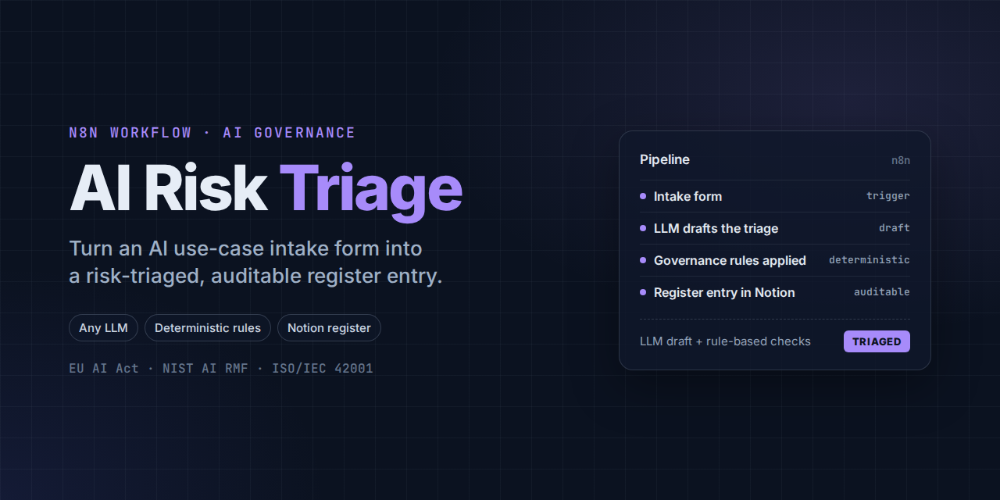
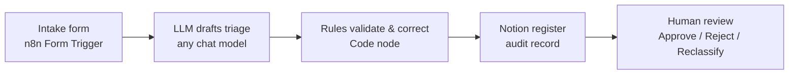

# AI Use-Case Intake & Risk Classifier

[](https://github.com/garynair/ai-risk-triage/actions/workflows/test.yml)

An n8n workflow that turns an AI use-case intake form into a **risk-triaged, auditable register entry** in Notion, using any LLM you choose (local or cloud) plus deterministic governance rules.



**What each submission gets**

| Output | Source |
|---|---|
| EU AI Act risk tier (prohibited / high / limited / minimal) + rationale | LLM, with rule-based floor |
| NIST AI RMF focus (GOVERN / MAP / MEASURE / MANAGE) | LLM |
| ISO/IEC 42001 Annex A control themes (A.5–A.10) | LLM + deterministic rules |
| Key risks, open questions, confidence | LLM |
| Status: `CLASSIFIED` or `NEEDS_REVIEW` | Rules |
| Traceability: model, prompt version, n8n execution ID, raw output | Workflow |

> ⚠️ **Triage signal, not a legal determination.** Outputs support human reviewers; they do not replace legal or compliance judgment.

**Inspect the evidence:** [Reproducible synthetic sample run](docs/SAMPLE_RUN.md) shows a mocked model under-tiering a loan decision, followed by deterministic correction to `high` risk and `NEEDS_REVIEW`.

## Design principles

1. **Rules decide what can be decided from the form; the model handles judgment.** A high-risk domain + impact on individuals is *always* `high`, whatever the model says. Rules can raise severity, never lower it.
2. **Every high/prohibited, overridden, or low-confidence result goes to human review.**
3. **Model-agnostic.** Swap the chat-model node; nothing else changes. Run fully local (Ollama) when intake data is sensitive.
4. **Auditable.** Each entry records which model and prompt version produced it and links back to the n8n execution.
5. **Tested.** Automated tests run the rules straight from the workflow export on every push. Run them locally with `node --test` (see [docs/TESTING.md](docs/TESTING.md)).

## Quick start

| Step | Guide |
|---|---|
| 1. Prerequisites (n8n, Notion, a model) | [docs/SETUP.md](docs/SETUP.md#1-prerequisites) |
| 2. Choose and connect a model | [docs/MODELS.md](docs/MODELS.md) |
| 3. Create the Notion register | [docs/SETUP.md](docs/SETUP.md#3-create-the-notion-register) |
| 4. Import and configure the workflow | [docs/SETUP.md](docs/SETUP.md#4-import-and-configure-the-workflow) |
| 5. Run the test cases | [docs/TESTING.md](docs/TESTING.md) |

## Repository layout

```
workflow/ai-usecase-classifier.json   n8n workflow (import this)
notion/register_schema.json           Notion database schema (26 properties)
notion/create_register_db.sh          Creates the database via the Notion API
docs/SETUP.md                         Step-by-step setup
docs/MODELS.md                        Using Ollama, OpenAI, Anthropic, Gemini, OpenRouter, etc.
docs/GOVERNANCE.md                    How tiers, rules, and framework mappings work - and their limits
docs/TESTING.md                       Test cases and a validation method
docs/SAMPLE_RUN.md                    Reproducible synthetic sample and evidence boundary
docs/sample-run.json                  Generated rules output and Notion request body
docs/SECURITY.md                      Token handling, data residency, prompt injection
docs/TROUBLESHOOTING.md               Known issues and fixes
scripts/generate-sample-run.mjs       Regenerates docs/sample-run.json from the workflow code
tests/*.test.mjs                      Automated rule and workflow tests (node --test)
tests/test-cases.md                   Manual smoke-test cases
tests/validation-template.csv         Template for a labeled validation set
```

## Frameworks referenced

EU AI Act (risk tiers, Annex III), NIST AI RMF 1.0 (core functions), ISO/IEC 42001:2023 (Annex A control objectives). Mappings are simplified for triage - see [docs/GOVERNANCE.md](docs/GOVERNANCE.md).

## Author

**Girish Nair** — Cyber GRC & AI Governance

## License

MIT — see [LICENSE](LICENSE).
